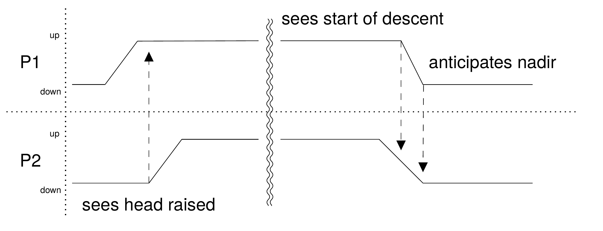
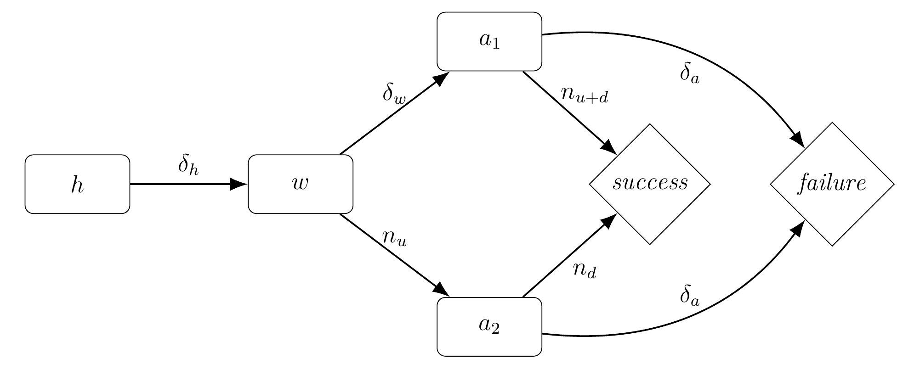

Jordan Henderson,
currently based in Glasgow UK,
is a composer/artist/musician obsessed with how small groups of people interact and coexist while playing music together.
They are attempting to make computer generated audiovisual beings that sit onstage and interact in a comparable way,
watching and listening to other performers while responding through sound and communicating gesturally; this forms the topic of their ongoing PhD.


Presentation website
[https://jordanhendersonmusic.github.io/NotamSC_27_3_24/](https://jordanhendersonmusic.github.io/NotamSC_27_3_24/)


---

## Setup:

- I write music for people to play, usually score based composition. <!-- .elements: class="fragment" -->
- I make things with computers, including electronic music/sound art. <!-- .elements: class="fragment" -->
- I like watching people play music. <!-- .elements: class="fragment" -->
- I like listening to sound art. <!-- .elements: class="fragment" -->
- But often I've found that performances with instrumentalism's and live electronics lack something. <!-- .elements: class="fragment" -->

---

### Liveness

---

#### New Types of Liveness

* Auslander 2008, *Liveness: Performance in a Mediatized Culture*.
* Sanden 2013, *Liveness in Modern Music*.

---

#### Instrumentality

John Croft, somewhat moving away from liveness, instead suggests an relationship between the computer and the perform based on *instrumentality*, 
where the performer's body is extended. Croft 2007.


<iframe width="560" height="315" src="https://www.youtube-nocookie.com/embed/BLBRQLqpGXY?si=9VGOmDz8_k0fRXl9" title="YouTube video player" frameborder="0" allow="accelerometer; autoplay; clipboard-write; encrypted-media; gyroscope; picture-in-picture; web-share" referrerpolicy="strict-origin-when-cross-origin" allowfullscreen></iframe><!-- .elements: class="fragment" -->


...but I find this less effective when watching the performance over listening to it. <!-- .elements: class="fragment" -->

---


* With an audio recording it is often not possibly to tell who makes the sound.
* In the performance it is quite clear when the bow disconnects from the string.<!-- .elements: class="fragment" -->
* The audio creates a cellist + something hybrid performer.<!-- .elements: class="fragment" -->
* In the performance there is clearly only one person.<!-- .elements: class="fragment" -->
* In the performance there is an issue of spatialization.<!-- .elements: class="fragment" -->

---

Perhaps the *visual* performative element of music hasn't been considered.


This does align with the idea that music is a 'sonic' art.<!-- .elements: class="fragment" -->


---

As a quick aside...

Sanden also considers Daniel Omar's *The Flaying of Marsyas*, terming this type of liveness a 'performing cyborg', which moves towards theatre.

Instead, I want to consider the inherit visual and performative aspect of existing musical performance practices, particularly small ensembles (string quartets).

---

Perhaps a computer generated performer can be made to sit on stage next to a human?

---

* Auslander, Philip - *Liveness: Performance in a Mediatized Culture* Routledge 2008

* Sanden, Paul - *Liveness in modern music: musicians, technology, and the perception of performance* Routledge: New York 2013

* Croft, John - *Theses on liveness* Organised Sound 2007

* Croft, John; Ballon, Severine - *La terra lagrimosa...una luce vermiglia* 2014 

* Omar, Daniel - *The Flaying of Marsyas* 2001


---

## Example

<iframe width="560" height="315" src="https://www.youtube-nocookie.com/embed/dkfVzCZ68_Q?si=XDzJ6n4LQGHez7xU" title="YouTube video player" frameborder="0" allow="accelerometer; autoplay; clipboard-write; encrypted-media; gyroscope; picture-in-picture; web-share" referrerpolicy="strict-origin-when-cross-origin" allowfullscreen></iframe>

Profeti della Quinta *Mille regretz* Josquin des Prez 

---

### Dance

Sometimes the performers move in a way that isn't communicative but contains emotive information about the work.
<!-- .elements: class="fragment" -->

This is the upwards motion found in the beginning which I can't help but copy.
<!-- .elements: class="fragment" -->

Because everyone is moving upwards, I physically experience this as an 'inhale'.
<!-- .elements: class="fragment" -->

This relates to ideas of empathy in dance.
<!-- .elements: class="fragment" -->

> 'Even while sitting still, dancers (and others) can feel they are participating in the movements they observe'
Warburton 2011.
<!-- .elements: class="fragment" -->

---

Movement is experience as movement. <!-- .elements: class="fragment" -->

---

### Teamwork and Participation

Where performers gesture and look at each other to aid in synchronisation.
<!-- .elements: class="fragment" -->

This causes me to 'play' along, following their gaze, noticing their gestures, waiting and watching just as the performers do.
<!-- .elements: class="fragment" -->

Physically following these movements make me care about the performance, 
about the work's construction in a way that isn't present in sound.
<!-- .elements: class="fragment" -->


I feel involved in the team, despite being in the audience, and a sense of agency over the work. 
<!-- .elements: class="fragment" -->

Which is reinforced by a study by Reddish et al 2019 that suggests participant can feel agency over interactions that are not reciprocated.
<!-- .elements: class="fragment" -->

---

### Sound affects vision

> `seemingly extraneous cues from one modality can substantially alter judgments of stimulus intensity in another modality'
Stein, et al 1996.

---


*ensemblematic experience*


...perhaps this is what I found 'lacking' from those performances of instrument + live electronics
<!-- .elements: class="fragment" -->

---

Warburton, Edward C. *Of Meanings and Movements: Re-Languaging Embodiment in Dance Phenomenology and Cognition* 
Dance Research Journal 2011 

Stein, Barry E; London, Nancy; Wilkinson, Lee K.; Price, Donald D. 
*Enhancement of Perceived Visual Intensity by Auditory Stimuli: A Psychophysical Analysis*
Journal of Cognitive Neuroscience 1996


Reddish, Paul; Tong, Eddie M. W.; Jong, Jonathan; Whitehouse, Harvey 
*Interpersonal synchrony affects performers' sense of agency*
Self and Identity 
2019

---

# How *do* musicians communicative?


... and can ideas be applied to model human - computer communication.
<!-- .elements: class="fragment" -->

---

Fuchs, considering interaction as a whole,
puts forward an idea of intercorporeality and when considering dancers suggests they might share a dyadic body memory.

> 'In face--to--face encounters, each partner's lived body reaches towards the other to form an overarching system through interbodily resonance and mutual incorporation'
Fuchs 2017
<!-- .elements: class="fragment" -->


See  Kaiser 2023 for an example of this applied to instrumental music. 
<!-- .elements: class="fragment" -->

---

Keller 2008 suggests that during performances musicians look at one another, 
not only to cue, 
to but to update an 'internal model' of each other so they can predict each other's actions.

Bishop et al 2019 studies the importance of directed eye gaze,
finding that solo/accompaniment roles look at each other equally.
<!-- .elements: class="fragment" -->


---

Bishop, Laura; Cancino-Chacon, Carlos; Goebl, Werner
*Eye gaze as a means of giving and seeking information during musical interaction*
Consciousness and Cognition
2019


Fuchs, Thomas *Intercorporeality and Interaffectivity*
Oxford University Press
2017

Keller, Peter E. *Enacting intersubjectivity: A cognitive and social perspective to the study of interactions*
IOS Press
2008


Kaiser, Jessica *Exploring Musical Togetherness: An embodied approach to relational interpretation in Maurizio Pisati's Sette Duo*
Music and Practice  
2023


---

# Nod model



Performers must be able to see when each other's heads are raised and lowered.
<!-- .elements: class="fragment" -->

---

# Nodding Gesture Model

* holding
* waiting
* anxious




---

# Applying this in Jellyfish

* Google's mediapipe + Python for head tacking using a webcam mounted on the microphone.
<!-- .elements: class="fragment" -->
* Visuals in Unity.
<!-- .elements: class="fragment" -->
* Supercollider + Flucoma for sound
<!-- .elements: class="fragment" -->
* Supercollider + a custom Quark for mapping everything together
<!-- .elements: class="fragment" -->

---

This mapping, is similar to that discussed in NIME, but build sets of maps that can be interpolated.

I'm calling this behavioural mapping,
as each map describes some behaviour/relationship between the human and computer.

---

[https://github.com/JordanHendersonMusic/JX-supercollider](https://github.com/JordanHendersonMusic/JX-supercollider)

Functional, but not well documented.

---

### Three parts:
* Building static synth graph and connecting it together

```supercollider
s.waitForBoot {
	var a = JXSynthDef('/a', {
		JXOut.ar(\out, SinOsc.ar(2));   
	});

	var b = JXSynthDef('/b', {
		JXIn.ar(\in, 1)
	})
	.connect(a[\out] -> \in);  
}
```


---

* Declaring sources and sinks of data
```supercollider
JXOscStore.registerExternalSinks(
	NetAddr("localhost", 23425) -> [
		(osc: '/pd/freq', chans: 1),
		(osc: '/pd/amp',  chans: 2),
	]
);

JXOscStore.registerExternalSrc(
    NetAddr("localhost", 5623) -> [
		(osc: '/pd/value', chans: 1),
		(osc: '/pd/xy', chans: 2)
	]
);
```

```supercollider
JXSynthDef.new('/test', {
    var inGain = JXOscSink.kr('/gain', 0);

    var outAmp = LFNoise2.kr() * inGain;
    JXOscSrc.kr('/amp', outAmp);
});
```

---

SC demo of mapping

---


Each section of Jellyfish is a map that is interpolated as the work progresses.

---

```supercollider
var map1 = JXOscMapMk({|srcs| 
```
<!-- .elements: class="fragment" data-fragment-index="3" -->

```supercollider
holdState = JXOSCMap((
    ...
));
waitState = JXOSCMap((
    ...
));
anxiState = JXOSCMap((
    ...
));
```
<!-- .elements: class="fragment" data-fragment-index="1" -->

```supercollider
var n = JXNodder(
    src['/webcam/nod'],
    src['/nodGesture/state'], 
    holdStaet,
    waitState,
    anxiState
);
```
<!-- .elements: class="fragment" data-fragment-index="2" -->

```supercollider

n ++ otherMaps
})
```
<!-- .elements: class="fragment" data-fragment-index="3" -->

---


<iframe width="560" height="315" src="https://www.youtube.com/embed/tRFPDGTPHSk?si=XXt6dHTx91JdDoDQ" title="YouTube video player" frameborder="0" allow="accelerometer; autoplay; clipboard-write; encrypted-media; gyroscope; picture-in-picture; web-share" referrerpolicy="strict-origin-when-cross-origin" allowfullscreen></iframe>


